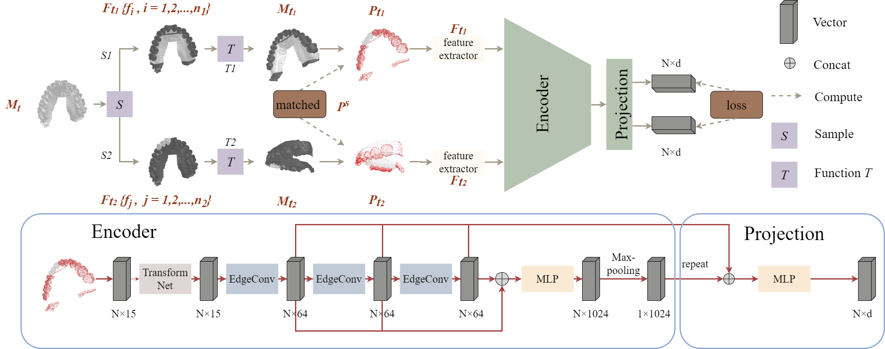

# Unsupervised-Pre-training
Unsupervised Pre-training Improves Tooth Segmentation in 3-Dimensional Intraoral Mesh Scans (Accept at MIDL2022)
# Abstract
Accurate tooth segmentation in 3-Dimensional (3D) intraoral scanned (IOS) mesh data is an essential step for many practical dental applications. Recent research highlights the success of deep learning based methods for end-to-end 3D tooth segmentation, yet most of them are only trained or validated with a small dataset as annotating 3D IOS dental surfaces requires complex pipelines and intensive human efforts. In this paper, we propose a novel method to boost the performance of 3D tooth segmentation leveraging large-scale unlabeled IOS data. Our tooth segmentation network is first pre-trained with an unsupervised learning framework and point-wise contrastive learning loss on the large-scale unlabeled dataset and subsequently fine-tuned on a small labeled dataset. With the same amount of annotated samples, our method can achieve a mIoU of 89.38%, significantly outperforming the supervised counterpart. Moreover, our method can achieve better performance with only 40% of the annotated samples as compared to the fully supervised baselines. To the best of our knowledge, we present the first attempt of unsupervised pre-training for 3D tooth segmentation, demonstrating its strong potential in reducing human efforts for annotation and verification.




# Getting Started
## Environment
* Ubuntu 18.04
* CUDA 11.2
* Pytorch 1.9.0
* Open3d 0.9.0
* Trimesh 3.9.35
* MinkowskiEngine 0.5.4
## Train on your dataset
### Pretrain
For pre-training, put your dataset list to ``pretrain/dataset`` and rename it as ``overlap.txt``.
#### Dataset format
dataset  
├── 00000.stl  
 ……  
└── XXXXX.stl  
The ``.stl`` is a simple 3-Dimensional Intraoral Mesh Scan without label.
### Finetune
For fine-tuning, our codebase is based on [AnTao97/*dgcnn*.pytorch](https://github.com/AnTao97/dgcnn.pytorch). Similarly, please put your dataset lists to ``pretrain/dataset`` and rename them as ``teeth_train.txt``,``teeth_val.txt``,``teeth_test.txt``.
#### Dataset format
├── trainset  
│   ├── 00000.ply  
│    ……  
│   └── XXXXX.ply   
├── valset  
│   ├── 00000.ply  
│    ……  
│   └── XXXXX.ply   
├── testset  
│   ├── 00000.ply  
│    ……  
│   └── XXXXX.ply  
We process the original ``.stl`` format for faster training. A set of preprocessing tools are provided in ``finetune/data_preprocess``. Follow the README file in the ``finetune`` to generate the fine-tuning dataset. Here we list the details of ``.ply`` format data.  
├── 00000.ply   
│   ├── Face center[0]    
│   ├── Face center[1]  
│   ├── Face center[2]    
│   ├── Shape Descriptor[0]  
│   │    ……    
│   ├── Shape Descriptor[8]   
│   ├── Face normal[0]    
│   ├── Face normal[1]  
│   ├── Face normal[2]  
│   └── label  
Face center, shape descriptor and face normal have been defined in our paper.
### Train
#### Pretrain
```python  
 CUDA_VISIBLE_DEVICES=0,1 python main.py
```
#### Finetune
For *debugging purpose only*, we provide a pretrained model in ``finetune/pretrained_weights/checkpoint.pth``.   
Fine-tuning:  
```python  
 CUDA_VISIBLE_DEVICES=0,1 python ddp_main.py --pretrain=./pretrained_weights/checkpoint.pth --lenient_weight_loading=True --exp_name=finetune
```  
Train from scratch:
```python  
 CUDA_VISIBLE_DEVICES=0,1 python ddp_main.py --exp_name=from_scratch
```
## Inference
During fine-tuning, we only sample 20,000 points to train and test. If you want to obtain the labels of unsampled points, you can apply kNN strategy to the segmentation result. Meanwhile, there are also many methods to achieve it, e.g. putting all faces into the model and graph-cut. So you can choose the appropriate method for post-processing with your needs.
